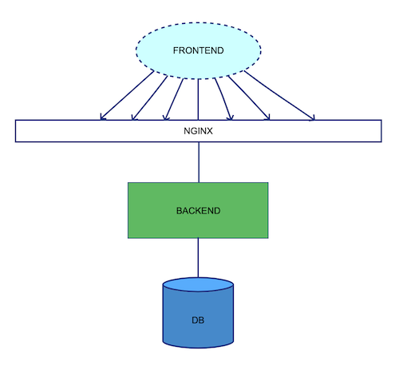

# Education project - online store

**Description**: Online store for sell products.
Frontend and Nginx didn't realize it's only in plans. Works only PostgreSQL with Backend.

## Development setup

### Prerequisites:

0) Install [Git](https://git-scm.com/book/en/v2/Getting-Started-Installing-Git)
1) Install Docker (Choose one of the following)
    * [Windows](https://hub.docker.com/editions/community/docker-ce-desktop-windows)
    * [Mac OS](https://hub.docker.com/editions/community/docker-ce-desktop-mac)
    * Ubuntu
        1) [Docker](https://docs.docker.com/install/linux/docker-ce/ubuntu/)
        2) Docker-Compose    
            1) Run `sudo curl -L "https://github.com/docker/compose/releases/download/1.24.0/docker-compose-$(uname -s)-$(uname -m)" -o /usr/local/bin/docker-compose`
            2) Run `sudo chmod +x /usr/local/bin/docker-compose`
        3) Update current user groups
            1) Run `sudo groupadd docker && sudo usermod -aG docker $USER`
2) Install [Python 3.8.0] and pipenv

### Clone the Repo

Run `git clone git@github.com:Luckywookie/architector.git`

### Docker compose start

Run `docker-compose up -d`

### REST API Documentation and Test

Go `http://host:8888/swagger`

### Mail Service (View online emails)

Go `http://0.0.0.0:8025`

### Request & Response Examples

#### POST /user/register

After registration send notification to email and telegram message to your chat 

Example: http://host:port/api/v1/user/register

Parameters:

|   **Name**    |   **Type**    | **Mandatory** |
| ------------- | ------------- | ------------- |
|   username    |    STRING     |      YES      |
|   password    |    STRING     |      YES      |

Response SUCCESS body:

`
{
    "success": true
}
`

#### POST /auth

Example: http://host:port/api/v1/auth

Parameters:

|   **Name**    |   **Type**    | **Mandatory** |
| ------------- | ------------- | ------------- |
|   username    |    STRING     |      YES      |
|   password    |    STRING     |      YES      |

Response SUCCESS body:

`
{
    "access_token": "string"
}
`

#### POST /logout

Example: http://host:port/api/v1/logout

#### GET /user?username=<username>

Example: http://host:port/api/v1/user?username=<username>

Parameters:

|   **Name**    |   **Type**    | **Mandatory** |
| ------------- | ------------- | ------------- |
|   username    |    STRING     |      YES      |

Response SUCCESS body:

`
{
    "username": "test-user"
}
`

#### GET /user/all

Example: http://host:port/api/v1/user/all

Parameters: NO

Response SUCCESS body:

`
[
    {
        "username": "test"
    },
    {
        "username": "test-user"
    }
]
`

### Catalog

#### GET /categories

Example: http://host:port/api/v1/categories

Parameters: No

Response SUCCESS body:

`
[
    {
        "description": "test-category-desc",
        "id": 1,
        "title": "test-category"
    },
    {
        "description": "test-category-desc2",
        "id": 2,
        "title": "test-category2"
    }
]
`

#### POST /category

Example: http://host:port/api/v1/category

Parameters: 

|   **Name**    |   **Type**    | **Mandatory** |
| ------------- | ------------- | ------------- |
|   title    |    STRING     |      YES      |
|   description    |    STRING     |      YES      |

Response SUCCESS body:

`
{
    "success": true, "id": Integer
}
`

#### DELETE /category

Example: http://host:port/api/v1/category

Parameters: 

|   **Name**    |   **Type**    | **Mandatory** |
| ------------- | ------------- | ------------- |
|   id    |    STRING     |      YES      |

Response SUCCESS body:

`
{
    "success": true
}

#### GET /products

Example: http://host:port/api/v1/products

Parameters: NO

Response SUCCESS body:

`
[]
`

#### POST /product

Example: http://host:port/api/v1/product

Parameters: 

|   **Name**    |   **Type**    | **Mandatory** |
| ------------- | ------------- | ------------- |
|   title    |    STRING     |      YES      |
|   description    |    STRING     |      YES      |
|   category_id    |    INTEGER     |      YES      |

Response SUCCESS body:

`
{
    "success": true, "id": Integer
}
`

#### DELETE /product

Example: http://host:port/api/v1/product

Parameters: 

|   **Name**    |   **Type**    | **Mandatory** |
| ------------- | ------------- | ------------- |
|   id    |    STRING     |      YES      |

Response SUCCESS body:

`
{
    "success": true
}

